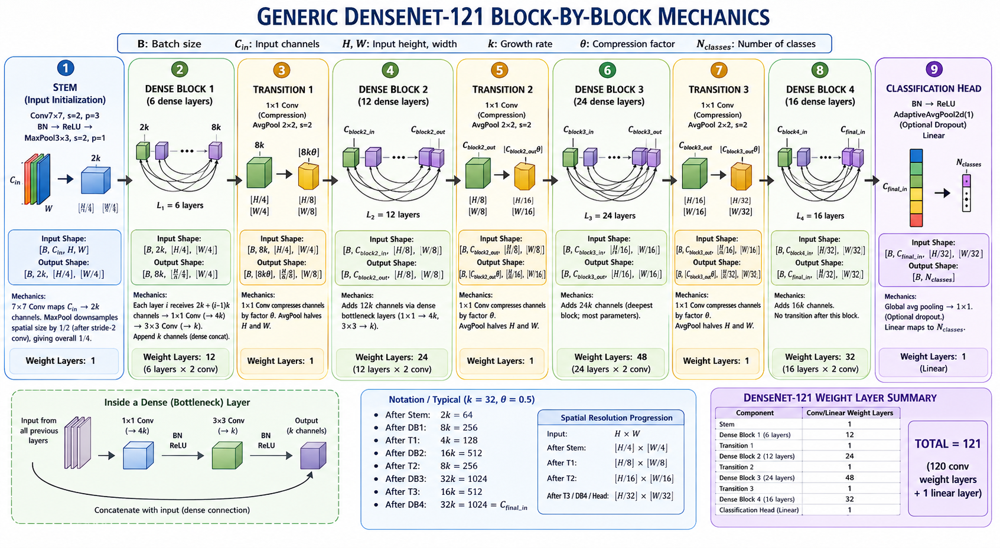

# DenseNet-121 on CIFAR-10

**Lab 6 — DATA 5322 Statistical Machine Learning II**  
Group 3: Jack Lichwa, Hemant Kumaar, Prithika Kandasamy

---

## Overview

This project studies the DenseNet architecture (Huang et al., CVPR 2017 Best Paper) and evaluates DenseNet-121 on CIFAR-10 image classification via two-phase transfer learning from ImageNet pretrained weights. Results are benchmarked against a plain 3-layer CNN and pretrained ResNet-18 using the identical training strategy.

---

## Results

| Model | Params | Test Accuracy |
|---|---|---|
| Plain CNN (3 conv layers) | 620 K | 65.98% |
| ResNet-18 (pretrained) | 11.2 M | 93.19% |
| **DenseNet-121 (pretrained)** | **7.0 M** | **95.66%** |

DenseNet-121 achieves the highest accuracy with fewer parameters than ResNet-18, demonstrating the efficiency of dense feature reuse.

---

## Architecture

DenseNet-121 uses four dense blocks (6 / 12 / 24 / 16 layers) with:
- **Growth rate k = 32** — each dense layer adds 32 new channels
- **Bottleneck design** — 1×1 Conv compresses to 128 channels before each 3×3 Conv
- **Transition layers** — compression ratio θ = 0.5 halves channels between blocks
- **Dense connectivity** — every layer receives feature maps from all preceding layers via concatenation



---

## Training

CIFAR-10 (32×32) images are resized to 224×224 and normalized with ImageNet statistics. Two-phase fine-tuning:

| Phase | Epochs | Layers updated | Head LR | Backbone LR |
|---|---|---|---|---|
| 1 — Warm-up | 1–2 | Classifier head only (~10 K params) | 1e-3 | frozen |
| 2 — Full fine-tune | 3–5 | All layers | 1e-4 | 1e-5 |

---

## Repository Structure

```
notebook/   DenseNet-121-CIFAR10.ipynb   — full experiment notebook
img/                                     — architecture diagrams and training plots
```

---

## Reference

Huang, G., Liu, Z., van der Maaten, L., & Weinberger, K. Q. (2017).  
*Densely Connected Convolutional Networks.* CVPR 2017.  
https://arxiv.org/abs/1608.06993

